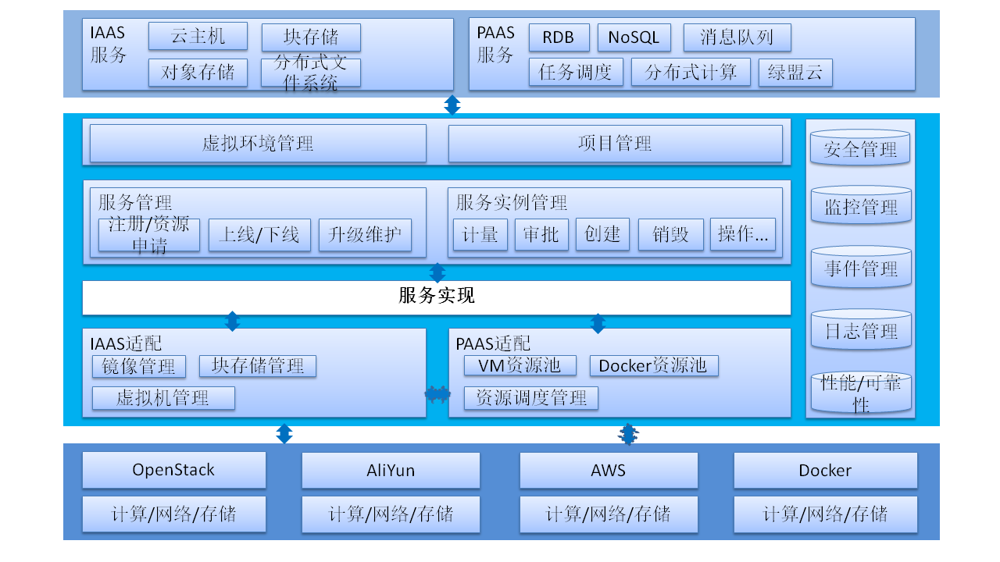
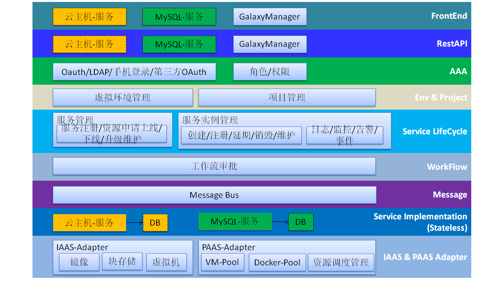
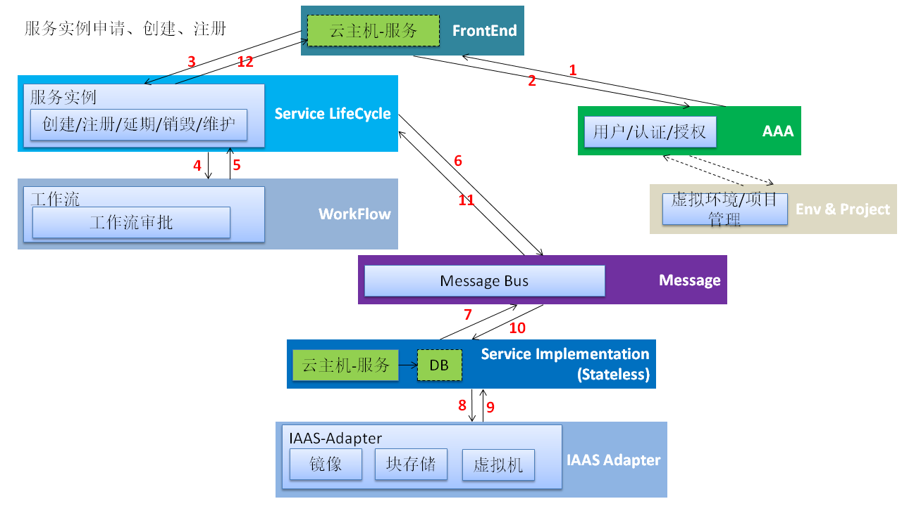
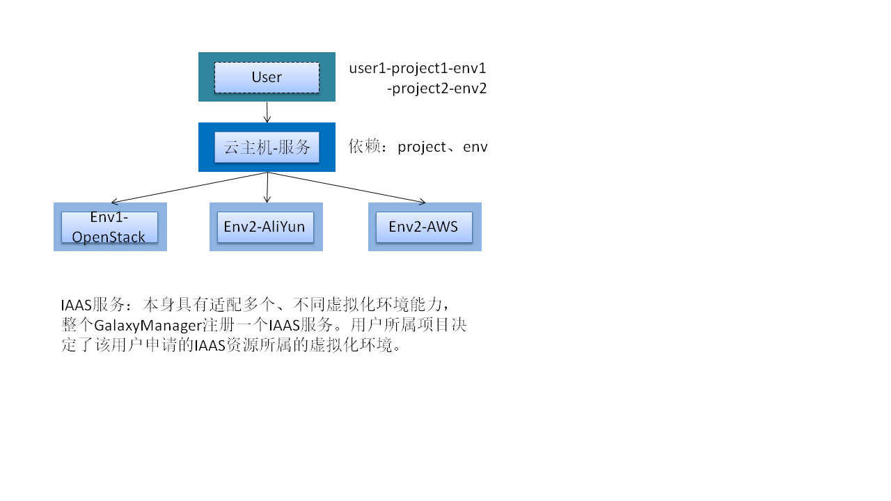

# xcloudfoundry
xcloudfoundry，旨在整合数据中心异构虚拟化资源为统一的资源池，并在资源池上为用户提供各类IAAS、PAAS服务。**系统正在大幅调整，现有代码已废弃，请忽略所有源码。**欢迎交流。

### Features:    
* 支持接入管理OpenStack、AliYun、AWS、Docker等混合云能力。
* 支持项目管理，以项目形式对外提供服务。
* 支持云主机、块存储等各种IAAS服务。
* 支持PAAS资源灵活调度（静态/动态方式，主机/Docker方式）。
* 支持服务实例申请、创建、注册。
* 支持工作流审批。
* 支持服务实例到期提醒、延期、销毁、以及其他维护操作自定义。
* 支持分钟级服务快速接入。
* 支持大规模场景，架构可横向扩展。
* 安全、可靠、高性能。

### Framework:    
* 产品概念架构:        

* 系统详细架构:    

* 服务实例申请流程:

* IAAS服务模型:

* PAAS服务模型:

### Contact Me:
* 欢迎对OpenStack、AliYun、AWS、Docker、Mesos/Marathon、K8S、IAAS、PAAS等感兴趣小伙伴多多交流。    
* WeChat:     

