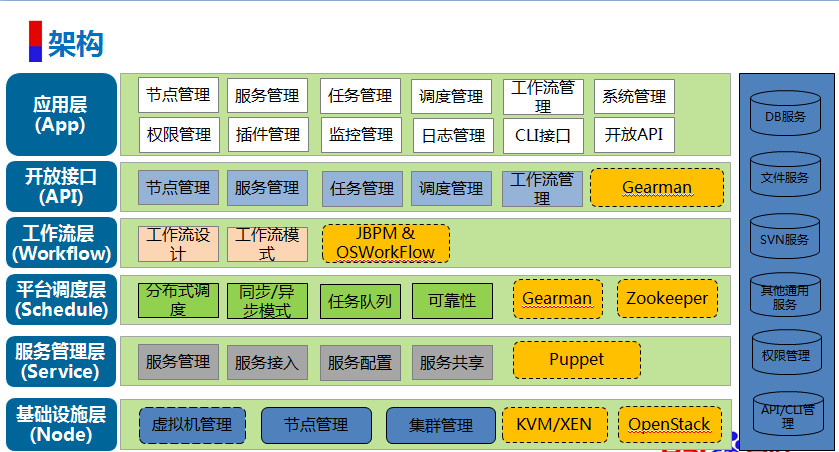

jgear
==============

通用分布式服务化平台，构建内部私有云平台的理想选择，项目持续开发中。

### 简介:
    通用分布式服务平台（内置pbrpc、http性能测试、ftp等多种常用服务）
    分布式调度（所有任务既可在节点池构建也可在指定节点构建；即可在单节点构建；也可在节点池并发构建）
    高性能（分布式构架；各模块全异步调用；支持多个集群、多个节点）
    高可靠性（GearServer支持主备；支持任务队列数据持久化；支持失败重试）
    易扩展（插件热插拔节点扩展方便；外部模块3分钟即可完成接入；接入即可API化）
    自动化（全流程自动化；任务状态实时监控）
    工作流（计划中，暂不支持）
    性能监控（内置集群/节点的系统级/进程级CPU、内存、网络监控功能）
    开放API、CLI管理

### 架构:
     
    
### 实现:
     

