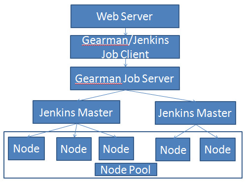

pbrpcbenchmark
==============

通用pbrpc高性能测试工具

### 简介:
* 简单、易用、通用的pbrpc高性能测试工具，不需要写代码。
* 异步实现，满足一般性能测试、延迟测试、最大连接数测试、压力测试、长时间稳定性测试、内存泄漏测试等场景。
* 支持多种PBRPC协议：PUBLIC-PBRPC、SOFA-PBRPC、HULU-PBRPC。
* 支持json格式数据做为请求源、支持返回数据json输出。
* 支持请求参数灵活定制，支持发送线程、工作线程配置。
* 支持客户端socket连接个数配置。
* 支持请求发送速率配置：支持固定QPS模式、支持压力山大模式。压力山大模式下，单线程20个连接QPS约15000左右。满足高性能测试要求。
* 支持配置请求随机发送、顺序发送。
* 支持返回结果校验。
* 计划进一步实现pbrpc功能/性能测试全流程自动化、服务化，敬请期待。

### 使用:
* 工具使用：    
     
     

